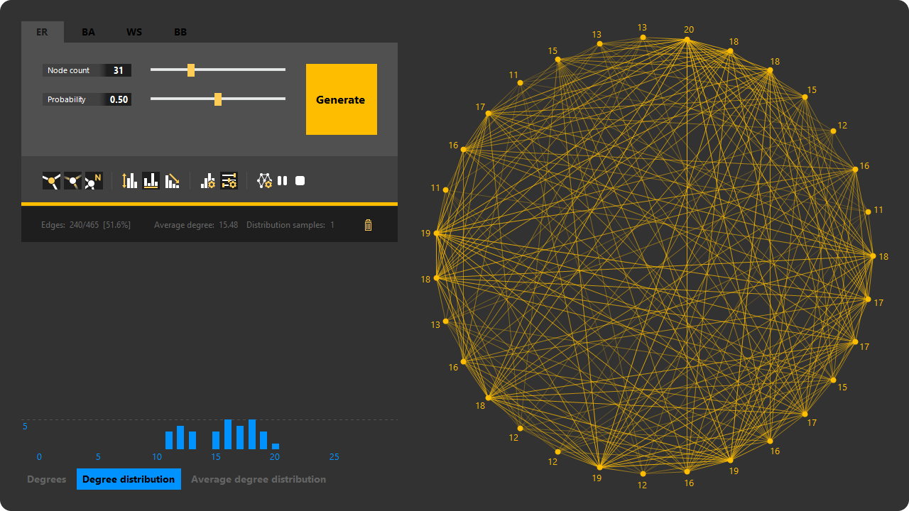
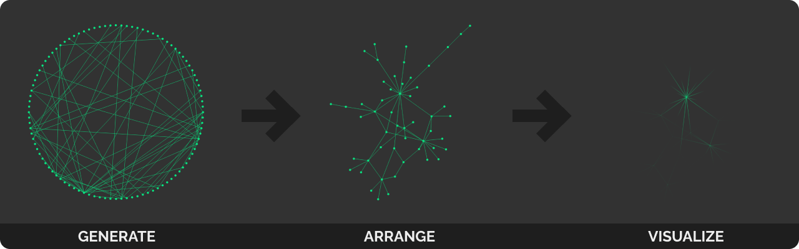

# Graphs

A graph visualizer and generator for educational purposes.

* Capable of generating graphs following the [Erdős-Rényi](https://en.wikipedia.org/wiki/Erd%C5%91s%E2%80%93R%C3%A9nyi_model), [Barabási-Albert](https://en.wikipedia.org/wiki/Barab%C3%A1si%E2%80%93Albert_model), [Watts-Strogatz](https://en.wikipedia.org/wiki/Watts%E2%80%93Strogatz_model) and [Bianconi-Barabási](https://en.wikipedia.org/wiki/Bianconi%E2%80%93Barab%C3%A1si_model) models
* Features a [force-directed graph drawing](https://en.wikipedia.org/wiki/Force-directed_graph_drawing) algorithm
* Visualizes the properties of the generated graph with three charts and a graph view
* Calculates the average degree distribution, supported by sample generation
* Customization options

## Force-directed graph drawing

With the nodes attracting each other and edges acting as springs, a force-directed graph drawing algorithm arranges the graph so that the number of crossing edges are minimal.

## Interactive graph view

* Move nodes with **Left button** drag
* Delete nodes with **Right button** click
* Add nodes with **Middle button** drag from an existing node
* Add edges by dropping the new node on an existing one
* Hover nodes to highlight them on the chart