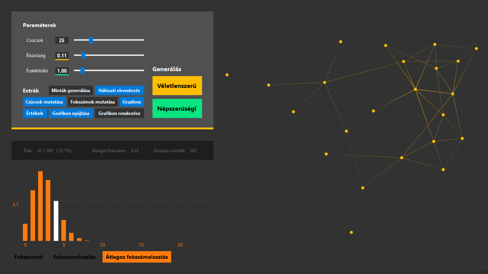

# Graphs

A simple graph generator for educational purposes.

* Capable of generating graphs following the **Erdős-Rényi** and **Barabási-Albert** models.
* Features a **force directed graph drawing** algorithm.
* Visualizes the properties of the generated graph with a chart and a graph view.
* Options to customize how the graph is displayed.

# Screenshots

